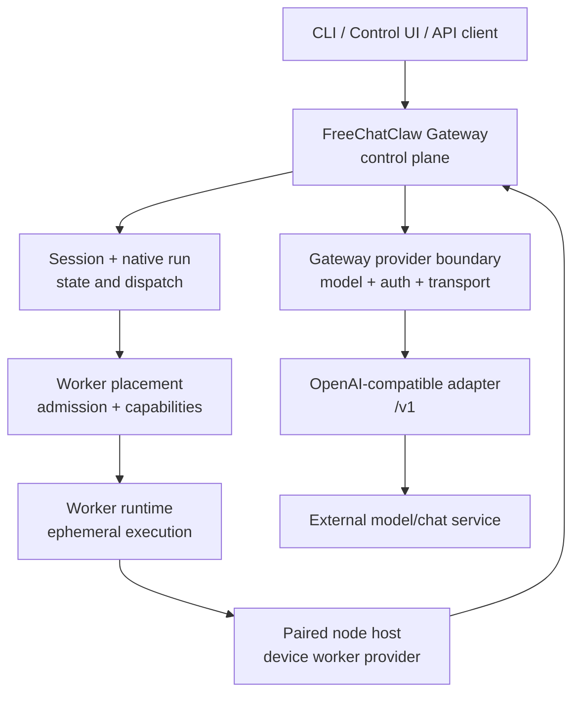

# FreeChatClaw architecture

FreeChatClaw is a maintained fork of OpenClaw 2026.9.5. The fork keeps the OpenClaw
Gateway, protocol, plugin, channel, agent-runtime, and node foundations while
adding FreeChatClaw-specific worker placement, native-session orchestration, provider
boundaries, and acceptance flows.

This page is the architectural entry point for FreeChatClaw. It describes ownership and
runtime contracts, not every implementation detail. Source code and tests remain
the executable authority.

## System shape



The important boundary is that **control-plane ownership stays in the
Gateway**. A worker executes admitted work; it does not become the owner of
provider credentials, session authority, or placement policy.

## Ownership map

| Responsibility                            | Owner                                                | Consumers                   |
| ----------------------------------------- | ---------------------------------------------------- | --------------------------- |
| Gateway protocol and request dispatch     | `src/gateway/`                                       | CLI, UI, nodes, tests       |
| Session lifecycle and native run identity | Gateway session/runtime owners                       | clients, workers            |
| Worker placement policy                   | `src/gateway/worker-environments/`                   | session dispatch, admission |
| Device worker provisioning                | `src/gateway/worker-environments/device-provider.ts` | placement service           |
| Node connection and device identity       | `src/node-host/` and node protocol                   | Gateway, worker host        |
| Model/provider resolution                 | Gateway model/auth/runtime path                      | inference execution         |
| Provider credentials                      | Gateway auth/provider transport                      | provider boundary only      |
| Worker execution                          | worker runtime / node host                           | admitted session            |
| Channel integrations                      | channel plugins                                      | Gateway                     |
| User-facing integrations                  | plugins and plugin SDK                               | core contracts              |

## Request lifecycle

For a native worker-backed session, the normal lifecycle is:

1. A client creates or selects a native session.
2. The Gateway resolves the session's runtime and placement requirements.
3. `sessions.dispatch` performs the native dispatch mutation. The request can
   identify the target by `profileId` or `deviceId`; those selectors are
   mutually exclusive.
4. Worker placement resolves capabilities and the provider responsible for the
   selected environment.
5. The device worker provider admits the task against an already paired node
   host when the device is the placement target.
6. The worker becomes active and attaches to the native session/run.
7. Native worker-turn execution runs through the worker protocol.
8. Gateway-side provider resolution prepares the selected model, auth, and
   transport. Provider credentials remain Gateway-owned.
9. The provider transport calls its configured endpoint.
10. The native session records the result and lifecycle state.

The exact implementation call graph should be checked against CodeGraph and
the current source before making a change. This document intentionally records
the contract rather than freezing private function names as public API.

## Native session versus worker

These are separate concepts.

- A **native session** owns the conversation/run identity and the native
  execution semantics.
- A **worker** is the execution placement for an admitted task.
- A **node host** is a device-side process that can satisfy a worker placement
  contract.
- A **provider** supplies model transport and owns the provider credential.

Do not replace a native session with a local worker result merely because the
worker can produce similar text. Native acceptance requires the real native
session/run lifecycle.

## Device placement contract

FreeChatClaw supports an already paired device node as a worker placement target. The
device provider therefore must not introduce a second cloud-node enrollment
requirement for that path.

The current device provider contract is:

```ts
requiresNodeEnrollment: false;
```

This means placement may be satisfied by the existing paired node host. It does
not weaken device identity or Gateway authorization; it removes only the
unrelated second enrollment requirement.

## Provider boundary

Provider selection and authentication are Gateway responsibilities.

For the FreeChatClaw ChatGPT Free integration the approved tuple is:

```text
provider = chatgpt-web
model    = chatgpt-free
api      = openai-completions
endpoint = isolated OpenAI-compatible /v1 adapter
```

The worker-facing inference contract remains credential-free. In particular,
provider API keys, authorization headers, and equivalent secrets must not be
placed in worker admission, node environment, worker RPC, or terminal result.

The provider boundary is described in more detail by
[FreeChatClaw provider and inference architecture](/provider-inference).

## Trust boundaries

### Gateway

The Gateway is the trusted control plane. It owns protocol validation, session
authority, model/auth preparation, placement decisions, and provider egress.

### Worker

Workers are execution surfaces. They receive only the data required by the
worker contract and must not become a credential store or alternate provider
selector.

### Node host

The node host is a device execution endpoint identified by its paired device
identity. A node process must not share one device identity with another live
node process.

### External provider

The external model/chat service is outside the Gateway trust boundary. The
Gateway provider adapter is the controlled egress point.

## State and identity

Keep these identities distinct:

- `sessionKey`: OpenClaw/FreeChatClaw session addressing.
- native `sessionId`: authoritative native runtime identity.
- native `runId`: authoritative native turn identity.
- `environmentId`: worker environment identity.
- `nodeId`: paired node identity.
- `leaseId`: worker admission lease.
- `ownerEpoch`: lifecycle ownership/versioning.
- `modelRef`: provider/model selection.

Do not manufacture one identity from another. Acceptance evidence must capture
the real values produced by the current runtime.

## Failure patterns to recognize

The following symptoms have architectural meanings:

- **Placement waits for a new node enrollment:** inspect the device provider's
  enrollment contract before changing pairing state.
- **`node pairing changed before request dispatch`:** suspect duplicate live
  node processes using one device identity before changing pairing policy.
- **A test attaches to an old worker:** select the worker by the current
  dispatch identity and active lifecycle state, not by first-match ordering.
- **A live build behaves differently from source:** verify `dist/build-info.json`
  and the build identity before debugging runtime state.

## Rules for extending FreeChatClaw

1. Find the existing owner before adding a new manager, registry, or side store.
2. Preserve the native session path; do not create a parallel local execution
   shortcut for acceptance.
3. Keep provider credentials at the Gateway provider boundary.
4. Keep placement policy in the worker-environment owner.
5. Keep node identity in the node/pairing owner.
6. Use real runtime evidence for lifecycle claims.
7. Prefer a focused contract test plus real-flow proof over a mock that bypasses
   the owner under test.

## Related

- [FreeChatClaw runtime topology](/runtime-topology)
- [FreeChatClaw provider and inference architecture](/provider-inference)
- [FreeChatClaw development and validation](/development-validation)
- [FreeChatClaw fork identity and compatibility](/fork-identity)
- [Gateway architecture](/concepts/architecture)
- [Agent runtime architecture](/agent-runtime-architecture)
