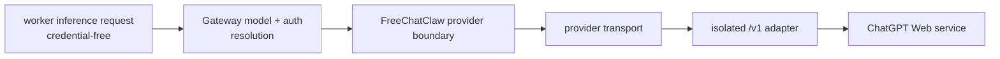

# FreeChatClaw provider and inference architecture

FreeChatClaw separates **where work runs** from **where model authentication and provider
transport are owned**. Worker placement must never imply provider credential
ownership.

## The contract

For the current ChatGPT Free integration:

```text
modelRef: chatgpt-web/chatgpt-free
provider: chatgpt-web
model: chatgpt-free
api: openai-completions
baseUrl: isolated OpenAI-compatible /v1 endpoint
credential owner: Gateway
worker credential: none
```

The worker request carries model identity, context, and inference options. The
Gateway prepares the provider request and keeps the credential local to that
provider transport boundary.

## Data flow



The raw credential must not cross from `Resolve` into the worker protocol.

## What belongs in each layer

### Worker inference

Allowed:

- admitted run/session identity;
- resolved model reference;
- context and inference options;
- normal worker lifecycle metadata.

Forbidden:

- provider API keys;
- authorization headers;
- provider-specific secret blobs;
- fallback instructions that change the approved provider.

### Gateway provider preparation

Owns:

- model/provider resolution;
- credential selection;
- provider-specific request construction;
- provider endpoint selection;
- provider failure semantics.

### Provider boundary

The FreeChatClaw boundary is fail-closed for the approved Phase 4 tuple. A wrong
provider, model, API, or endpoint must not be silently substituted.

## Forbidden fallback

If the ChatGPT Free route is unavailable or unauthenticated, FreeChatClaw must fail at
provider preparation or transport. It must not silently switch to:

- OpenAI Platform API-key execution;
- a local model;
- another provider;
- a synthesized local result.

This is both an acceptance requirement and an architectural invariant.

## Testing strategy

Provider tests should prove three layers separately:

1. **Boundary tests:** exact provider/model/API tuple and fail-closed behavior.
2. **Serialization tests:** no credential material enters worker/node payloads.
3. **Live proof:** a real native turn reaches the isolated `/v1` provider route.

A mock that returns the expected text without crossing the provider boundary is
not sufficient evidence for the live provider claim.

## Related

- [FreeChatClaw architecture](/architecture)
- [FreeChatClaw runtime topology](/runtime-topology)
- [FreeChatClaw development and validation](/development-validation)
