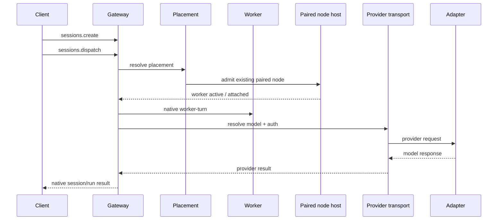

# FreeChatClaw runtime topology

This document explains the concrete topology used by FreeChatClaw's native worker path.
It is deliberately separate from the higher-level architecture page because
runtime debugging needs process, port, and lifecycle boundaries that should not
be confused with the product architecture.

## Logical topology

## Process boundaries

The production and isolated environments must be treated as different systems.

For the Phase 4 proof topology used during development:

| Component          | Isolated endpoint | Purpose                                                  |
| ------------------ | ----------------- | -------------------------------------------------------- |
| Production adapter | `127.0.0.1:8318`  | Existing service; never repurpose for FreeChatClaw tests |
| Production Gateway | `127.0.0.1:9010`  | Existing service; never repurpose for FreeChatClaw tests |
| Isolated adapter   | `127.0.0.1:18318` | FreeChatClaw ChatGPT Free-compatible provider route      |
| Isolated Gateway   | `127.0.0.1:19012` | FreeChatClaw native E2E control plane                    |

These ports describe the known Phase 4 development topology. New tests should
prefer dynamically allocated isolated ports unless a fixed port is required by
the external integration.

## Gateway lifecycle

An isolated Gateway must use:

- a fresh state directory;
- a unique admission/idempotency identity;
- a build generated from the current source tree;
- isolated provider configuration;
- isolated temporary/worktree roots;
- no dependency on production Gateway state.

Before trusting live evidence, verify the running build identity. A source fix
that is absent from the running `dist` tree is not a runtime regression.

## Node lifecycle

An already paired node host has one device identity. Only one live node process
may own that identity at a time.

The expected lifecycle is:

1. Node host starts with its persistent device identity.
2. Node connects to the isolated Gateway.
3. Gateway recognizes the paired identity.
4. Device placement admits work against that node.
5. Worker becomes active and attaches to the native session.
6. Native worker-turn executes.
7. Worker is reclaimed during test cleanup.

Starting a second node host with the same device identity is a topology error,
not evidence that pairing is missing.

## Admission semantics

Worker admission has two concepts that must not be conflated:

- **Node enrollment:** establishing or extending cloud-node enrollment.
- **Device placement:** using an existing paired device node as the execution
  target.

FreeChatClaw's device placement path uses the second concept. It must not accidentally
require the first.

## Native dispatch

`sessions.dispatch` is the intended native mutation path for dispatching an
existing session onto a worker placement. Do not create an acceptance-only
internal function that bypasses it.

The dispatch request identifies the placement target using exactly one of the
supported selectors, such as `profileId` or `deviceId`. The server resolves the
rest of the placement and lifecycle state.

## Live E2E observability

A useful live proof records:

- Gateway build identity;
- `sessionKey`;
- native `sessionId`;
- native `runId`;
- `environmentId`;
- `nodeId`;
- `leaseId`;
- `ownerEpoch`;
- `modelRef`;
- worker lifecycle state;
- provider/model/API attribution;
- final native result;
- cleanup/reclaim outcome.

Do not use historical worker rows as proof for a current dispatch. A test must
select the worker created or activated by its current dispatch identity.

## Cleanup

Live E2E cleanup is part of correctness. A successful test must reclaim its
worker/session resources before stopping the isolated Gateway. Cleanup failures
must be visible; they must not be hidden by process shutdown.

## Related

- [FreeChatClaw architecture](/architecture)
- [FreeChatClaw development and validation](/development-validation)
- [Gateway architecture](/concepts/architecture)
